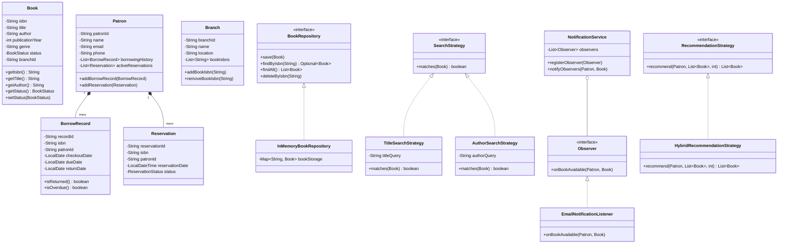

# 📚 Library Management System (Java)

A production-grade, object-oriented Library Management System built in Java. Designed and implemented adhering strictly to **Object-Oriented Programming (OOP)**, **SOLID Principles**, and key **Design Patterns** (Observer, Strategy, Factory, Builder).

---

## 🌟 Key Features

### 📖 1. Core Requirements
- **Book Management**: Full CRUD operations for books with title, author, ISBN, publication year, genre, branch location, and inventory status.
- **Search Engine**: Flexible search system to locate books by title, author, ISBN, or composite criteria.
- **Patron Management**: Register library members, update patron details, and track complete borrowing transaction history.
- **Lending Process**: Book checkout and return workflow with due-date calculation, availability verification, and active loan tracking.
- **Inventory Tracking**: Monitor available, borrowed, reserved, and in-transfer books across branches.

### 🚀 2. Extension Features
- **Multi-Branch Support**: Track multiple physical/logical library branches and transfer books between branches.
- **Reservation System & Observer Notifications**: Queue mechanism for checked-out books. When a reserved book is returned, the **Observer Pattern** notifies interested subscribers (e.g., Email, In-App alerts).
- **Recommendation Engine**: Generates personalized book recommendations for patrons based on borrowing history, genre frequencies, author preferences, or hybrid scoring algorithms.

---

## 📐 Architecture & Design Principles

### Object-Oriented Programming (OOP)
- **Encapsulation**: Domain models (`Book`, `Patron`, `Branch`, `BorrowRecord`, `Reservation`) encapsulate their state behind private attributes and expose clean getters/setters with validation.
- **Abstraction**: Abstract contracts (`BookRepository`, `SearchStrategy`, `RecommendationStrategy`, `Subject`, `Observer`) hide underlying implementation details.
- **Inheritance & Polymorphism**: Strategy and Observer pattern implementations polymorphically fulfill interfaces at runtime.

### SOLID Principles
- **Single Responsibility Principle (SRP)**: Each class has a single, well-defined purpose (e.g., `LendingService` manages loans; `NotificationService` handles event alerts; `BookRepository` manages persistence abstraction).
- **Open/Closed Principle (OCP)**: Search strategies and recommendation algorithms can be added by implementing new strategies without modifying existing service code.
- **Liskov Substitution Principle (LSP)**: All strategy and repository implementations can seamlessly replace their parent interfaces without altering program correctness.
- **Interface Segregation Principle (ISP)**: Interfaces (`Observer`, `Subject`, `SearchStrategy`, `BookRepository`) are focused and minimalist.
- **Dependency Inversion Principle (DIP)**: High-level business logic services depend on high-level abstractions (`BookRepository`, `PatronRepository`), not concrete database implementations.

---

## 🏗️ Applied Design Patterns

1. **Observer Pattern** (`com.library.notification`):
   - `Subject` & `NotificationService` dispatch events when a reserved book is returned.
   - `EmailNotificationListener` and `InAppNotificationListener` observe book availability.
2. **Strategy Pattern** (`com.library.search` & `com.library.recommendation`):
   - Search: `TitleSearchStrategy`, `AuthorSearchStrategy`, `IsbnSearchStrategy`, `CompositeSearchStrategy`.
   - Recommendations: `GenreBasedRecommendationStrategy`, `AuthorBasedRecommendationStrategy`, `HybridRecommendationStrategy`.
3. **Factory Pattern** (`com.library.factory`):
   - `BookFactory` encapsulates creation logic for standard, fiction, and reference books.
4. **Builder Pattern** (`com.library.builder`):
   - `BookBuilder` and `PatronBuilder` provide a fluent API for entity construction.

---

## 📊 Class Diagram



---

## ⚡ How to Build & Run

### Prerequisites
- **JDK 17+** (Java 26 supported) installed and available on system PATH (`java -version`).

### Run via PowerShell (Windows)
```powershell
powershell -ExecutionPolicy Bypass -File .\run.ps1
```

### Run via Batch (CMD)
```cmd
run.bat
```

### Manual Compilation & Execution
```cmd
# Compile all source files into bin directory
javac -d bin -sourcepath src src/com/library/Main.java

# Execute Main runner
java -cp bin com.library.Main
```

---

## 📁 Directory Structure

```text
library-management-system/
├── README.md
├── run.ps1
├── run.bat
└── src/
    └── com/
        └── library/
            ├── Main.java
            ├── builder/
            │   ├── BookBuilder.java
            │   └── PatronBuilder.java
            ├── factory/
            │   └── BookFactory.java
            ├── model/
            │   ├── Book.java
            │   ├── BookStatus.java
            │   ├── BorrowRecord.java
            │   ├── Branch.java
            │   ├── Patron.java
            │   ├── Reservation.java
            │   └── ReservationStatus.java
            ├── notification/
            │   ├── EmailNotificationListener.java
            │   ├── InAppNotificationListener.java
            │   ├── NotificationService.java
            │   ├── Observer.java
            │   └── Subject.java
            ├── recommendation/
            │   ├── AuthorBasedRecommendationStrategy.java
            │   ├── GenreBasedRecommendationStrategy.java
            │   ├── HybridRecommendationStrategy.java
            │   └── RecommendationStrategy.java
            ├── repository/
            │   ├── BookRepository.java
            │   ├── BranchRepository.java
            │   ├── InMemoryBookRepository.java
            │   ├── InMemoryBranchRepository.java
            │   ├── InMemoryPatronRepository.java
            │   └── PatronRepository.java
            ├── search/
            │   ├── AuthorSearchStrategy.java
            │   ├── CompositeSearchStrategy.java
            │   ├── IsbnSearchStrategy.java
            │   ├── SearchStrategy.java
            │   └── TitleSearchStrategy.java
            ├── service/
            │   ├── BookService.java
            │   ├── BranchService.java
            │   ├── LendingService.java
            │   ├── PatronService.java
            │   ├── RecommendationService.java
            │   └── ReservationService.java
            └── util/
                └── LoggerUtil.java
```
